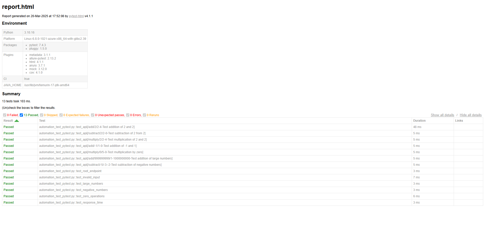

# Backend API Test Automation

A comprehensive API testing framework demonstrating automated testing of a FastAPI backend using pytest, GitHub Actions, and various testing tools.

## Troubleshooting

### Initial GitHub Actions Issues and Solutions

The workflow initially failed due to several issues that were resolved:

1. **Invalid Workflow File**

    - Error: "Invalid workflow file: .github/workflows/TestAutomation.yml#L18"
    - Cause: Multiple 'run' commands in the same step
    - Solution: Separated commands into different steps and fixed YAML syntax

2. **Missing Action Version**

    - Error: "Missing download info for actions/upload-artifact@v2"
    - Cause: Outdated action version
    - Solution: Updated to actions/upload-artifact@v4

3. **Test Execution Failure**

    - Error: "Process completed with exit code 2"
    - Cause: Missing dependencies and import issues
    - Solution: Added httpx and starlette to requirements.txt, fixed test imports

4. **Missing Artifacts**
    - Error: "No files were found with the provided path: ./allure-results"
    - Cause: Directory not created before running tests
    - Solution: Added step to create allure-results directory

These issues were resolved by:

-   Fixing YAML syntax in workflow file
-   Updating GitHub Actions versions
-   Adding missing dependencies
-   Creating necessary directories
-   Improving test structure

## Features

-   FastAPI server with arithmetic endpoints
-   Automated testing with pytest
-   GitHub Actions CI/CD integration
-   Performance testing with Locust
-   HTML and Allure test reporting
-   Environment configuration management
-   Parameterized test cases
-   Error handling and validation

## Project Structure (also contains original files like api.py, test.py etc. just for reference)

```
.
├── apiserver.py              # FastAPI server implementation
├── automation_test_pytest.py # Main test suite
├── performance_test.py       # Load testing with Locust
├── config.py                # Environment configuration
├── requirements.txt         # Project dependencies
└── .github/
    └── workflows/
        └── TestAutomation.yml  # GitHub Actions workflow
```

## Implementation Details

### 1. API Server (apiserver.py)

-   FastAPI-based REST API
-   Endpoints for arithmetic operations
-   Input validation and error handling
-   Automatic API documentation

### 2. Test Suite (automation_test_pytest.py)

-   Parameterized test cases
-   Edge case testing
-   Error handling tests
-   Performance benchmarks
-   Allure reporting integration

### 3. Performance Testing (performance_test.py)

-   Load testing with Locust
-   Concurrent user simulation
-   Response time monitoring
-   Performance metrics collection

### 4. Configuration (config.py)

-   Environment-specific settings
-   Test configuration parameters
-   Base URL management
-   Timeout settings

## Test Report Screenshot

Here's a screenshot of the generated test report:



_Note: The screenshot shows the test execution results including passed tests, coverage information, and performance metrics._

## Getting Started

### Prerequisites

-   Python 3.10+
-   pip (Python package manager)
-   Git

### Installation Steps:

1. Clone the repository:

```bash
git clone <repository-url>
cd <repository-name>
```

2. Create and activate virtual environment:

```bash
python -m venv venv
source venv/bin/activate  # On Windows: venv\Scripts\activate
```

3. Install dependencies:

```bash
pip install -r requirements.txt
```

### Running the Server

```bash
python apiserver.py
```

Server starts at `http://localhost:8000`

### Running Tests

1. Unit Tests with Coverage:

```bash
pytest automation_test_pytest.py -v --cov=apiserver --html=report.html
```

2. Performance Tests:

```bash
locust -f performance_test.py --host=http://localhost:8000
```

## Test Reports

-   HTML Report: `report.html`
-   Allure Report: Run `allure serve ./allure-results`
-   Coverage Report: Generated in terminal

## CI/CD Pipeline

The project uses GitHub Actions for continuous integration:

1. Runs on push and pull requests
2. Sets up Python environment
3. Installs dependencies
4. Runs unit tests
5. Performs load testing
6. Generates and uploads reports

## Test Cases

### Unit Tests

-   Basic arithmetic operations
-   Edge cases (negative numbers, zero)
-   Error handling
-   Input validation
-   Response time checks

### Performance Tests

-   Concurrent user simulation
-   Response time monitoring
-   Load testing scenarios
-   Resource utilization

## Configuration

### Environment Variables

-   `API_BASE_URL`: Base URL for API (default: http://localhost:8000)
-   `ENV`: Environment (development/staging/production)
-   `TEST_TIMEOUT`: Test timeout in seconds
-   `PERFORMANCE_TEST_USERS`: Number of simulated users

### Test Configuration

-   Coverage threshold: 80%
-   Performance test duration: 1 minute
-   Concurrent users: 10
-   Spawn rate: 1 user/second

## API Documentation

Access API documentation at:

-   Swagger UI: `http://localhost:8000/docs`
-   ReDoc: `http://localhost:8000/redoc`

## Monitoring and Logging

-   Test execution logs
-   Performance metrics
-   Error tracking
-   Coverage reports

## Contributing

1. Fork the repository
2. Create a feature branch
3. Commit your changes
4. Push to the branch
5. Create a Pull Request

## Acknowledgments

-   FastAPI for the web framework
-   pytest for testing framework
-   Locust for performance testing
-   GitHub Actions for CI/CD
-   Allure for test reporting

## Author
Vidhi Jaju
